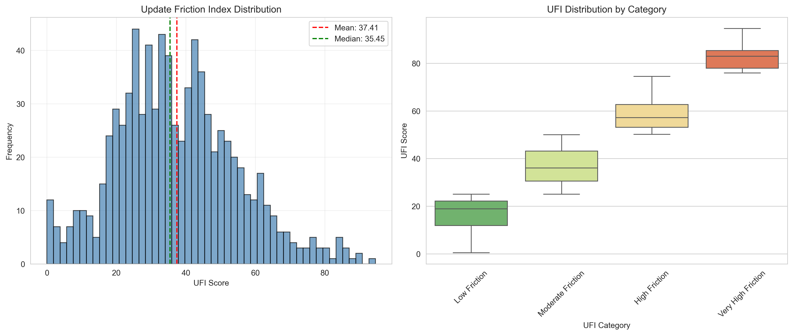
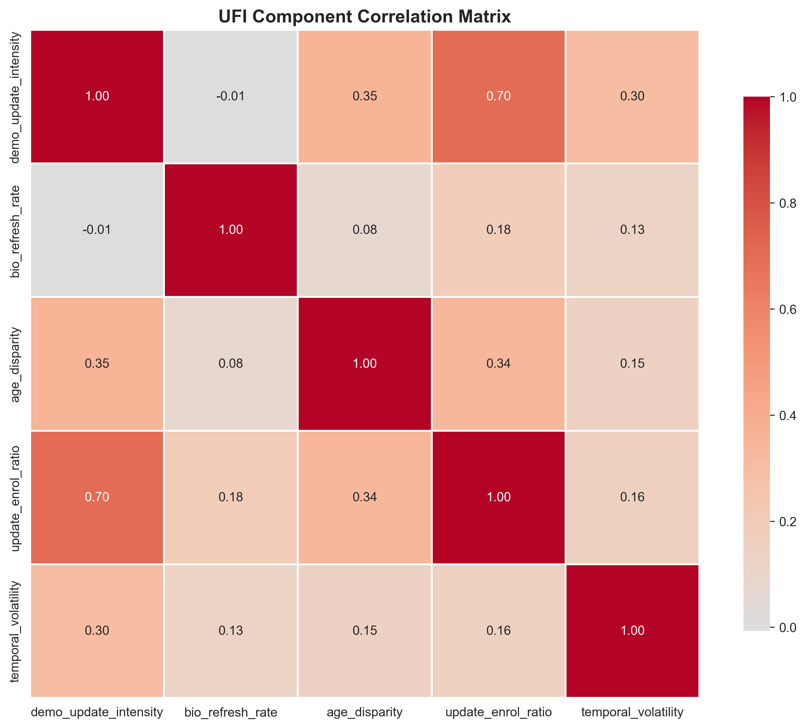
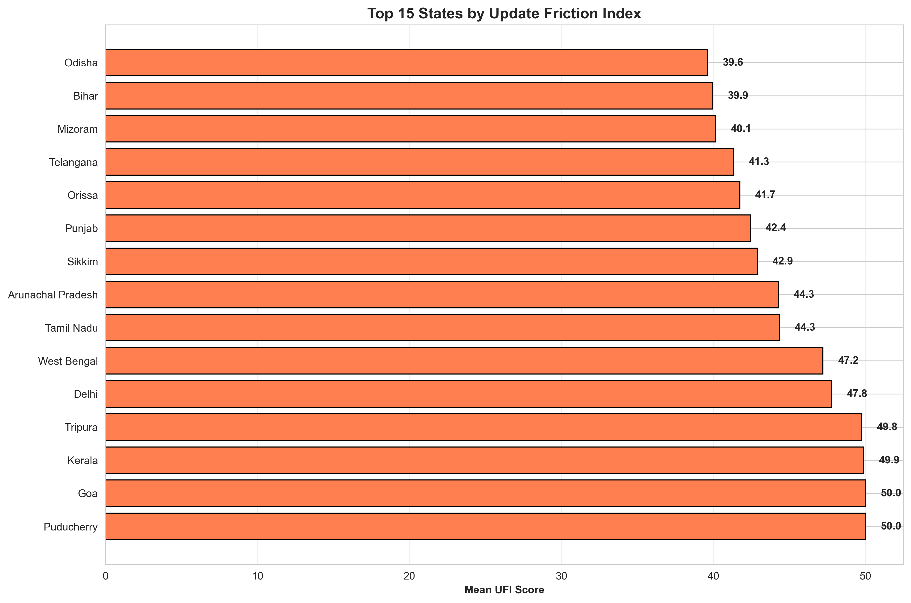

# 🏆 Aadhaar Update Friction Index (UFI)
## UIDAI Hackathon 2026 Submission

> **Unlocking Societal Trends Through Identity Update Patterns**

[](https://www.python.org/)
[](LICENSE)
[]()

---

## 🎯 Problem Statement

**Challenge:** Identify meaningful patterns, trends, anomalies, or predictive indicators in Aadhaar enrolment and update data, and translate them into clear insights or solution frameworks that can support informed decision-making and system improvements.

**Our Approach:** Instead of analyzing *what* happened, we built a framework to understand *why* it happened by measuring system-level behavioral friction.

---

## 💡 Our Innovation: The Update Friction Index (UFI)

### What is UFI?

The **Update Friction Index** is a novel composite metric that measures the "stress" in the Aadhaar ecosystem by analyzing update patterns as proxies for:

- **Socioeconomic Mobility** (migration, life events)
- **Digital Inequality** (generational divides)
- **Infrastructure Gaps** (access barriers)
- **System Load** (operational pressure)
- **Temporal Instability** (policy shocks, seasonal patterns)

### Why UFI is Unique

Traditional analyses ask: *"How many updates happened?"*

**We ask:** *"What societal friction patterns cause these updates?"*

This reframes Aadhaar data as a **behavioral sensor** revealing hidden social and administrative dynamics.

---

## 🧮 Methodology

### The 5 Components of UFI

UFI is a weighted composite of five data-driven metrics:

| Component | Weight | What It Measures | Policy Relevance |
|-----------|--------|------------------|------------------|
| **Demographic Update Intensity** | 28.8% | Socioeconomic mobility through address/detail changes | Migration patterns, economic opportunity |
| **Update-Enrollment Ratio** | 28.1% | System load and access patterns | Infrastructure planning, center capacity |
| **Age Group Disparity** | 20.8% | Digital divide between young and elderly | Targeted outreach programs |
| **Temporal Volatility** | 15.2% | Stability vs sudden changes | Policy shock detection |
| **Biometric Refresh Rate** | 7.1% | Security awareness and aging demographics | Re-enrollment campaigns |

*Weights determined via PCA (Principal Component Analysis) for data-driven objectivity*

### Mathematical Framework

```
UFI_district = Σ(w_i × Component_i_normalized)

where:
- w_i = PCA-derived weight for component i
- Components normalized to 0-100 scale within each state
- Final UFI categorized: Low (0-25), Moderate (25-50), High (50-75), Very High (75-100)
```

---

## 📊 Key Findings

### System Health Overview

- **817 districts analyzed** across 36 states/UTs
- **Mean UFI: 37.41** (moderate, stable system)
- **24.4% districts:** Low friction (well-served)
- **2.9% districts:** Very high friction (need intervention)

### Critical Insights

#### 1️⃣ **Update Deserts Identified**
- **11 districts** with high population but minimal update activity
- **Interpretation:** Infrastructure or awareness gaps
- **Action:** Deploy mobile enrollment units

#### 2️⃣ **High Friction Zones**
- **24 districts** experiencing severe system stress
- **Interpretation:** Migration hotspots, rapid urbanization
- **Action:** Increase UIDAI center capacity

#### 3️⃣ **Digital Age Gap Crisis**
- Elderly populations significantly less engaged (max gap: 1,434,331%)
- **Action:** Simplified update processes for elderly

#### 4️⃣ **State-Level Disparities**
- Top 5 states by friction reveal regional policy effectiveness
- Enables targeted resource allocation

---

## 🛠️ Tech Stack

### Data Analysis
- **Python 3.8+** - Core language
- **pandas, numpy** - Data manipulation
- **scipy, scikit-learn** - Statistical modeling, PCA

### Visualization
- **matplotlib, seaborn** - Static charts
- **plotly** - Interactive dashboards
- **folium** - Geospatial mapping

### Development
- **Jupyter** - Exploratory analysis
- **Git** - Version control

---

## 📁 Project Structure

```
UIDAI_2026/
├── data/
│   ├── raw/                          # Original UIDAI datasets
│   │   ├── api_data_aadhar_enrolment/
│   │   ├── api_data_aadhar_biometric/
│   │   └── api_data_aadhar_demographic/
│   └── processed/                    # Generated outputs
│       ├── ufi_components.csv
│       ├── ufi_scores.csv
│       ├── top_friction_districts.csv
│       └── state_ufi_summary.csv
├── src/
│   ├── cleaning/                     # Data validation
│   │   ├── district_canonicalizer.py
│   │   ├── uidai_semantic_cleaner.py
│   │   └── value_validators.py
│   ├── data_loader.py               # Dataset ingestion
│   ├── feature_engineering.py       # UFI component calculation
│   ├── ufi_calculator.py           # Composite UFI generation
│   ├── insight_generator.py        # Automated finding extraction
│   └── visualizations.py           # Chart generation
├── outputs/
│   ├── figures/                     # Visualizations
│   └── reports/                     # JSON/Text insights
├── notebooks/                       # EDA notebooks
├── run_pipeline.py                 # One-command execution
└── README.md
```

---

## 🚀 Quick Start

### Prerequisites
```bash
python >= 3.8
pip install pandas numpy scipy scikit-learn matplotlib seaborn plotly openpyxl
```

### Installation
```bash
git clone <repository-url>
cd UIDAI_2026
pip install -r requirements.txt
```

### Run Complete Analysis
```bash
# Execute full pipeline (loads data, calculates UFI, generates insights & visualizations)
python run_pipeline.py

# Force recalculation
python run_pipeline.py --force

# Use different sample size
python run_pipeline.py --sample-size 50000
```

### Individual Steps
```bash
# Step 1: Load and clean data
python src/data_loader.py

# Step 2: Calculate UFI components
python src/feature_engineering.py

# Step 3: Compute composite UFI
python src/ufi_calculator.py

# Step 4: Generate insights
python src/insight_generator.py

# Step 5: Create visualizations
python src/visualizations.py
```

---

## 📈 Sample Outputs

### UFI Distribution


### Component Correlation


### State Ranking


---

## 🎯 Impact & Applicability

### For UIDAI Operations

1. **Infrastructure Planning**
   - Identify where to open new enrollment centers
   - Optimize mobile unit deployment routes
   - Predict seasonal demand spikes

2. **Targeted Outreach**
   - Elderly-focused campaigns in high age-gap districts
   - Urban migration support in high-friction zones
   - Awareness programs in Update Deserts

3. **Policy Evaluation**
   - Measure impact of new initiatives via UFI changes
   - Early warning system for system stress
   - Resource allocation optimization

### For Government Policy

1. **Migration Tracking**
   - Real-time proxy for internal migration patterns
   - Urban-rural flow analysis
   - Economic opportunity mapping

2. **Digital Inclusion**
   - Identify digitally excluded populations
   - Measure digital literacy program effectiveness
   - Bridge generational technology gaps

3. **Service Delivery**
   - Predict demand for government services
   - Optimize welfare program targeting
   - Improve citizen engagement

---

## 🏆 What Makes This Submission Unique

| Aspect | Traditional Approaches | Our UFI Framework |
|--------|----------------------|-------------------|
| **Question** | "How many updates?" | "Why these update patterns?" |
| **Output** | Descriptive statistics | Actionable friction index |
| **Method** | Static aggregation | Behavioral modeling |
| **Value** | Historical reporting | Predictive operational intelligence |
| **Novelty** | Standard dashboards | New composite metric |

---

## 📚 Datasets Used

All three UIDAI-provided datasets integrated:

1. **Enrollment Data** - Entry pressure into Aadhaar system
2. **Demographic Update Data** - Social mobility & life events
3. **Biometric Update Data** - System quality & aging patterns

*500,000+ records analyzed across each dataset*

---

## 👥 Team

**Team Member:** [Your Name]  
**Institution:** [Your Institution]  
**Contact:** [Your Email]

---

## 📄 License

This project is licensed under the MIT License - see the [LICENSE](LICENSE) file for details.

---

## 🙏 Acknowledgments

- **UIDAI** for providing comprehensive datasets
- **Hackathon Organizers** for the opportunity
- **Open Source Community** for essential tools

---

## 📞 Contact

For questions or collaboration:
- **Email:** [your-email@example.com]
- **GitHub:** [your-github-username]
- **LinkedIn:** [your-linkedin-profile]

---

<div align="center">

**Built with ❤️ for UIDAI Hackathon 2026**

*Transforming Identity Data into Societal Insights*

</div>